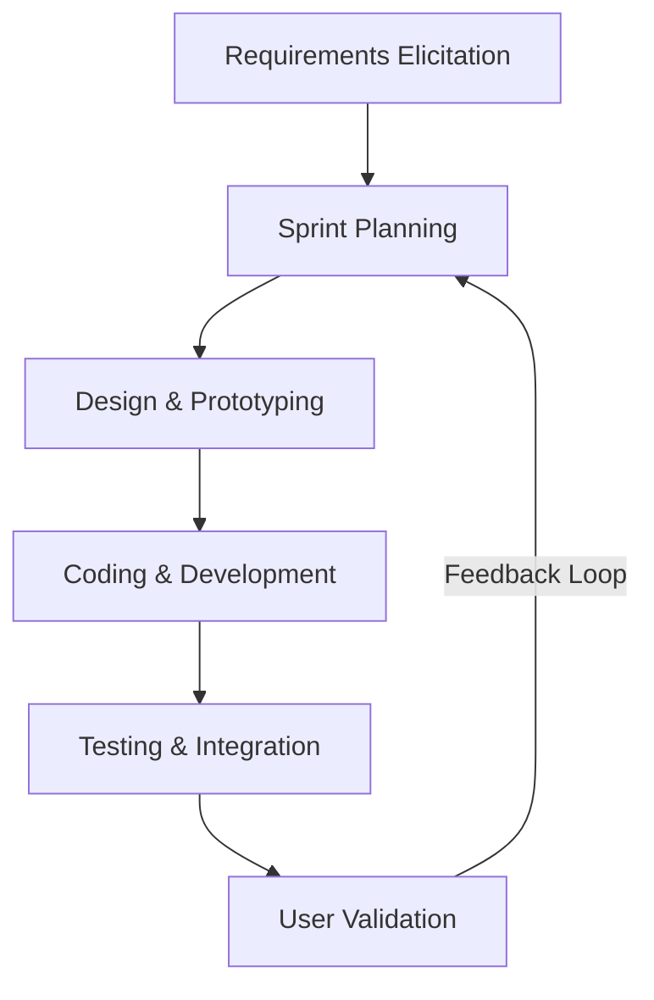
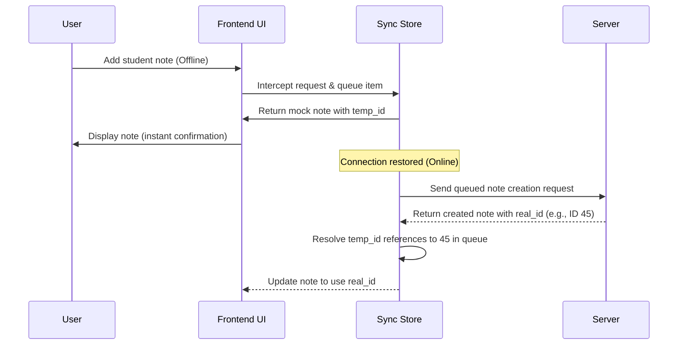

# VICTORIA UNIVERSITY
## FACULTY OF SCIENCE AND TECHNOLOGY
## DEPARTMENT OF COMPUTING AND INFORMATION SCIENCE

---

# TEACHER–STUDENT CLASS MANAGEMENT SYSTEM
## CASE STUDY: WAMPEEWO NTAKE SECONDARY SCHOOL, WAKISO

### FINAL PROJECT REPORT

**Course Name:** Final Year Project / Software Engineering Capstone  
**Academic Year:** 2025/2026  

---

### **SUBMITTED BY (GROUP 19):**
| Name | Reg. No | Student No. | Email Address | Phone Contact |
|---|---|---|---|---|
| MUTWEZI GELARD | VU-BIT-2307-1087-DAY | 230714543 | geraldvaros@gmail.com | 0772676944 |
| NABATANZI PAULINE | VU-BIT-2411-1141-DAY | 2401121963 | paulinenabatanzi@gmail.com | 0755885236 |
| DIMILIRE ANDREW | VU-BIT-2307-0935-DAY | 230714360 | dimilirea@gmail.com | 0706094920 |
| NUWABIINE DINAH | VU-BIT-2411-1868-DAY | 2401121703 | dinahnuwabiine@gmail.com | 0700996181 |
| KATONGOLE ABUBAKER | VU-BIT-2307-1108-DAY | 230714621 | akayabbey@gmail.com | 0751464880 |

### **SUPERVISED BY:**
| Supervisor Name | Designation | Faculty / Department |
|---|---|---|
| MS. NAJJEMBA OLIVIA | Project Supervisor | Science and Technology |

**Date of Submission:** June 2026

---

\newpage

## **DECLARATION**
We declare that the work presented in this project report is our original work and has not been submitted to any university or institution of higher learning for any academic award. All work from other authors has been fully acknowledged and cited appropriately.

Signed: _______________________________  
Date: _________________________________

---

## **APPROVAL**
This project report has been submitted for examination with the approval of the project supervisor.

Signed: _______________________________  
**MS. NAJJEMBA OLIVIA**  
Project Supervisor  
Date: _________________________________

---

## **DEDICATION**
This work is dedicated to the Almighty God for His guidance, protection and provision throughout our academic journey. We also dedicate it to our parents, guardians and families for their unwavering support, encouragement and sacrifice. Finally, we dedicate this report to our lecturers and supervisor whose guidance, patience and professional support made this project possible.

---

## **ACKNOWLEDGEMENT**
We sincerely thank the Almighty God for the gift of life, wisdom and strength throughout the period of this research and system development project.

Our special appreciation goes to our supervisor, Ms. Najjemba Olivia, for her guidance, encouragement, constructive criticism and continuous support from proposal writing up to the completion of this report. Her professional advice greatly shaped the quality of this work.

We also extend our gratitude to the administration, teachers and students of Wampeewo Ntake Secondary School for the cooperation they offered during requirements gathering and validation of the proposed Teacher–Student Class Management System.

We are grateful to the Faculty of Science and Technology and the Department of Computing and Information Science of Victoria University for the academic environment and resources that enabled us to complete this project. Finally, we thank our parents, colleagues and friends for the moral, financial and emotional support extended to us throughout the study.

---

\newpage

## **ABSTRACT**
This project focused on the design and development of a Teacher–Student Class Management System for Wampeewo Ntake Secondary School in Wakiso District. The study was motivated by challenges associated with manual and fragmented academic management processes, including difficulty in tracking assignments, delayed feedback, poor storage of learning materials, weak communication between teachers and students, and inefficient management of continuous assessment records. These challenges affect syllabus coverage, learner engagement and the effective implementation of Uganda’s competency-based curriculum.

The general objective of the study was to design and develop a centralized web-based system to support teaching, learning, assignment management and academic record keeping. Specifically, the study examined the existing methods used to manage classroom learning and assessment, designed a system to address the identified gaps, and developed and tested the proposed solution.

A systems development methodology based on the Systems Development Life Cycle (SDLC) was adopted. Data were collected using interviews, document review, and observation, supported by questionnaires. The findings showed that the current manual approach was time-consuming, prone to errors, difficult to monitor, and insecure for long-term storage of academic records. 

The proposed Teacher–Student Class Management System (Wampeewo TSCMS) provides modules for user authentication, class and subject management, assignment posting and submission, digital notes, attendance tracking, continuous assessment recording, feedback, and reporting. To ensure operation in low-connectivity areas, the system includes an advanced Offline Synchronization module which caches data locally and queues offline operations (like adding notes or marking attendance) to sync automatically when a connection is restored. The study concludes that the proposed system can significantly improve efficiency, accessibility, accountability, and communication in school academic processes. It is recommended that Wampeewo Ntake Secondary School adopt the system and support its implementation with user training, stable internet access, periodic backups, and clear data governance procedures.

---

\newpage

# **TABLE OF CONTENTS**
1. **CHAPTER 1: INTRODUCTION**
   - 1.1 Background of the Study
   - 1.2 Statement of the Problem
   - 1.3 Objectives of the Project
     - 1.3.1 General Objective
     - 1.3.2 Specific Objectives
   - 1.4 Scope of the Project
   - 1.5 Significance of the Study
2. **CHAPTER 2: LITERATURE REVIEW**
   - 2.1 Concept of Class Management Systems
   - 2.2 Teacher–Student Communication Systems
   - 2.3 Student Records and Academic Performance Management
   - 2.4 Challenges of Manual School Management
   - 2.5 Benefits of Automated Class Management Systems
   - 2.6 Database and Security Considerations
   - 2.7 Review of Existing Systems and Related Technologies
   - 2.8 Research Gap
3. **CHAPTER 3: RESEARCH METHODOLOGY AND DESIGN**
   - 3.1 Introduction
   - 3.2 System Development Methodology
   - 3.3 Requirements Gathering
     - 3.3.1 Sampling Techniques
     - 3.3.2 Target Population and Sample Size
   - 3.4 Data Collection Methods
4. **CHAPTER 4: SYSTEMS ANALYSIS AND DESIGN**
   - 4.1 Introduction
   - 4.2 Description of the Designed System
   - 4.3 Data Analysis and Results
   - 4.4 System User Requirements
   - 4.5 Functional and Non-functional Requirements
   - 4.6 High-Level Architecture
   - 4.7 Flow Chart of the Developed System
   - 4.8 Context Diagram & Level One DFD
   - 4.9 Use Case Diagram
   - 4.10 Entity Relationship Diagrams (ERD)
   - 4.11 Dynamic Modeling (Activity and Sequence Diagrams)
5. **CHAPTER 5: IMPLEMENTATION AND TESTING**
   - 5.1 Data Outputs and Forms
   - 5.2 Programming Languages and Frameworks Used
   - 5.3 Development Tools
   - 5.4 System Testing
   - 5.5 Chapter Summary
6. **CHAPTER 6: DISCUSSION, RECOMMENDATIONS, FUTURE WORK AND CONCLUSION**
   - 6.1 Discussion
   - 6.2 Limitations
   - 6.3 Recommendations and Future Work
   - 6.4 Conclusion
7. **REFERENCES**
8. **APPENDICES**

---

\newpage

# **CHAPTER ONE: INTRODUCTION**

## **1.1 Background of the Study**
Information and Communication Technology (ICT) has significantly transformed the education sector by improving communication, record management, content delivery and access to learning resources. Educational institutions increasingly rely on digital platforms to facilitate teaching, learning and academic administration. Learning Management Systems (LMS) enable teachers to share learning materials, administer assignments, monitor student progress and communicate with learners beyond the traditional classroom environment (Turnbull, Chugh, & Luck, 2021). These technologies have become particularly important in competency-based education, where continuous assessment, timely feedback and learner-centred instruction are fundamental components of the teaching process (Bond et al., 2020).

In Uganda, the introduction of the Competency-Based Curriculum (CBC) for lower secondary education has shifted the focus from examination-oriented learning to the acquisition of practical skills, critical thinking and continuous assessment. The curriculum emphasizes learner-centred instruction, project work, Activities of Integration (AOIs) and continuous monitoring of learner progress (Wambi et al., 2024). However, despite these reforms, many secondary schools continue to depend on paper-based records, handwritten notes, manual attendance registers and fragmented communication methods such as notice boards and verbal announcements. These practices make it difficult to manage assignments efficiently, store learning resources securely, monitor academic progress and retrieve records when required.

This project presents the design and development of a Teacher–Student Class Management System for Wampeewo Ntake Secondary School. The proposed system provides a centralized digital platform through which teachers can manage classes, upload notes and assignments, record continuous assessment scores, monitor attendance and communicate with students. Likewise, students will be able to access learning materials, submit assignments, receive feedback and monitor their academic performance through an integrated online environment.

## **1.2 Statement of the Problem**
Wampeewo Ntake Secondary School continues to experience significant challenges in managing teaching and learning activities due to its reliance on manual and fragmented systems. Teachers encounter difficulties in distributing assignments, maintaining continuous assessment records, tracking student attendance and providing timely feedback. Students also face challenges in accessing learning materials, submitting assignments electronically and monitoring their academic progress from a centralized platform. Furthermore, academic records are susceptible to loss, retrieval is time-consuming and communication between teachers and students remains inconsistent.

These limitations negatively affect instructional efficiency, learner engagement, accountability and the successful implementation of Uganda's Competency-Based Curriculum, which requires continuous assessment, learner participation and accurate documentation of student progress (Mwebaza, Nakawuki, & Francis, 2025). Without an integrated digital solution, both teachers and students continue to spend considerable time performing routine administrative tasks that could otherwise be automated. Therefore, there is a need to develop a centralized Teacher–Student Class Management System that automates assignment management, attendance tracking, continuous assessment, academic record management and teacher–student communication in order to improve academic administration and learning outcomes at Wampeewo Ntake Secondary School.

## **1.3 Objectives of the Project**

### **1.3.1 General Objective**
To design and develop a Teacher–Student Class Management System for Wampeewo Ntake Secondary School that improves the management of teaching, learning, assignments and academic records.

### **1.3.2 Specific Objectives**
i. To examine and analyse the existing methods and challenges used in managing academics and teacher–student engagement at Wampeewo Ntake Secondary School.  
ii. To design a centralized Teacher–Student Class Management System to support teaching, learning, assignments and academic record management.  
iii. To develop and test the proposed system using appropriate web technologies and system testing techniques.  

## **1.4 Scope of the Project**
- **Conceptual Scope:** Focuses on user registration and authentication, class/subject management, assignment posting and submission, digital note sharing, attendance tracking, continuous assessment recording, feedback management, and report generation.
- **Geographical Scope:** The study and pilot implementation were conducted at Wampeewo Ntake Secondary School, Wakiso District, Uganda.
- **Time Scope:** The system design, database modeling, front-end and back-end development, testing, and documentation were carried out over a six-month period from January 2026 to June 2026.

## **1.5 Significance of the Study**
- **To Wampeewo Ntake Secondary School:** Provides a centralized system that improves efficiency, accountability, and security of continuous assessment records.
- **To Teachers & Students:** Simplifies academic administration, note-sharing, and assignment feedback while keeping students engaged.
- **To Victoria University & Scholars:** Adds localized academic knowledge regarding Competency-Based classroom systems and provides a basis for future research in educational information systems.

---

\newpage

# **CHAPTER TWO: LITERATURE REVIEW**

## **2.1 Concept of Class Management Systems**
A class management system is a software platform used to coordinate classroom activities and support academic administration. Modern class management systems extend beyond content storage by facilitating attendance management, assignment distribution, communication, grading, reporting and learner engagement. In competency-based education, class management systems also support continuous assessment by enabling teachers to monitor learner progress and provide timely interventions. According to Bond et al. (2020), digital learning platforms enhance learner participation, collaboration and academic achievement when effectively integrated into classroom practice.

## **2.2 Teacher–Student Communication Systems**
Effective communication between teachers and students is essential for successful teaching and learning. Traditional communication methods such as classroom announcements, printed notices and verbal instructions often limit access to information outside school hours. Digital communication platforms improve interaction by enabling teachers to distribute assignments, announcements, reminders and feedback electronically. Martin, Sunley and Turner (2022) argue that effective digital communication strengthens learner engagement and improves collaboration between teachers and students in blended learning environments.

## **2.3 Student Records and Academic Performance Management**
Student records management involves maintaining attendance records, assessment scores, continuous assessment results, report cards and academic progress. Manual record management is often characterized by duplication, delayed reporting and difficulty retrieving historical data. Digital academic management systems centralize learner information, simplify record updates and generate reports automatically. According to Ifenthaler and Yau (2020), learning analytics and digital student records significantly improve academic monitoring and evidence-based educational decision making.

## **2.4 Challenges of Manual School Management**
Manual school management systems continue to present numerous operational challenges. These include repetitive paperwork, delayed information retrieval, data redundancy, human errors in calculations, weak accountability and increased risk of document loss. Physical records are vulnerable to damage, theft or misplacement, making long-term storage and retrieval difficult. As noted by Zawacki-Richter et al. (2019), institutions relying heavily on manual processes face significant limitations in efficiency, data management and service delivery compared to digital environments.

## **2.5 Database and Security Considerations**
Because school management systems process confidential learner information, database design and information security are critical considerations. Secure systems employ authentication mechanisms, role-based access control, encrypted communication and regular database backups to protect sensitive academic records. Proper database normalization also minimizes redundancy and improves data consistency and retrieval efficiency (Alshammari, Anane, & Hendley, 2021).

## **2.6 Review of Existing Systems and Related Technologies**
Systems such as Moodle and Google Classroom provide tools for content delivery, assignment management and communication between teachers and students. However, these platforms are designed for general educational environments and may not fully address the operational requirements of Ugandan secondary schools implementing competency-based education. Many existing school management systems focus mainly on administrative functions such as fees management, admissions and reporting rather than classroom interaction and continuous assessment (Turnbull, Chugh, & Luck, 2021).

## **2.7 Research Gap**
Despite the increasing adoption of digital learning systems worldwide, there remains limited research and implementation of localized class management systems specifically designed for Ugandan secondary schools. Existing systems rarely integrate assignment management, digital note sharing, attendance monitoring, continuous assessment, academic reporting and teacher–student communication into one simple platform tailored to the competency-based curriculum. This study addresses this gap by designing and developing a Teacher–Student Class Management System customized for Wampeewo Ntake Secondary School.

---

\newpage

# **CHAPTER THREE: RESEARCH METHODOLOGY AND DESIGN**

## **3.1 Introduction**
This chapter describes the methodology used to gather system requirements, analyse the existing environment and guide the design and development of the Teacher–Student Class Management System.

## **3.2 System Development Methodology**
This project adopted the Systems Development Life Cycle (SDLC) using an Agile Scrum development process. Agile was chosen because it allows continuous iteration and rapid feedback from teachers and administrators.



The SDLC stages included:
1. **Planning and Problem Identification:** Identifying challenges at Wampeewo Ntake Secondary School.
2. **Requirements Analysis:** Users' needs were gathered from teachers, students, and administrators.
3. **System Design:** Creating data models, Entity-Relationship Diagrams (ERDs), flowcharts, and use case diagrams.
4. **Implementation:** Writing the code for front-end and back-end logic.
5. **Testing and Validation:** Conducting functional, integration, performance, and security testing.

## **3.3 Requirements Gathering**
Requirements gathering was conducted to identify the needs, expectations and challenges of the intended users of the proposed system.

### **3.3.1 Sampling Techniques**
The study employed both purposive and simple random sampling techniques. Purposive sampling was used to select academic administrators and teachers. Simple random sampling was used to select students from different classes.

### **3.3.2 Target Population and Sample Size**
The target population comprised students, teachers and administrators of Wampeewo Ntake Secondary School. The sample size was determined using the Yamane (1967) formula:
n = N / (1 + N(e²))  
With a population of 565 members and a 5% margin of error, the sample size was **235 respondents**.

Table 3.1: Sample Size Distribution
| Category | Population (N) | Sample Size (n) |
|---|---|---|
| Teachers | 20 | 8 |
| Students | 535 | 219 |
| Administrators | 10 | 8 |
| **Total** | **565** | **235** |

## **3.4 Data Collection Methods**
- **Interviews:** Semi-structured interviews with 8 teachers and 8 administrators.
- **Document Review:** Inspection of attendance registers, mark books, syllabus sheets, and sample reports.
- **Observation:** Shadowing teachers during attendance marking and continuous assessment recording.
- **Questionnaires:** Administered to 219 students to assess their digital readiness and feature preferences.

---

\newpage

# **CHAPTER FOUR: SYSTEMS ANALYSIS AND DESIGN**

## **4.1 Description of the Designed System**
The Teacher–Student Class Management System (Wampeewo TSCMS) is a secure, role-based web application. The system provides three main dashboards:
- **Admin Dashboard:** Control center for registering teachers, students, classes, streams, and subjects.
- **Teacher Dashboard:** Interface for tracking attendance, building Activities of Integration (AOIs), grading submissions against competency scores (1 to 3), assessing generic skills, uploading study materials, and setting class timetables.
- **Student Dashboard:** Access point for retrieving study notes, submitting assignments, tracking attendance percentages, writing personal digital notes, and viewing feedback.

## **4.2 Functional and Non-functional Requirements**
- **Functional Requirements:** User login/logout, JWT authorization, user registration, stream mapping, attendance recording, AOI creation and digital submission, generic skill grading, personal notes manager, timetable entries, and announcement broadcasts.
- **Non-functional Requirements:** 
  - *Security:* Passwords hashed using bcrypt, role guards on all routes, API requests protected by JWT tokens.
  - *Availability:* Offline capability using `localStorage` caching and a FIFO sync queue to allow operations to be performed offline and synchronized automatically when online.
  - *Performance:* Page transitions under 2 seconds, database pooling to manage concurrent queries.

## **4.3 High-Level System Architecture**
The system uses a decoupled client-server architecture:
1. **Presentation Layer (Frontend):** React (TypeScript), Tailwind CSS, Vite.
2. **Business Logic Layer (Backend):** Node.js, Express (TypeScript), JWT Authentication.
3. **Database Layer (Storage):** MySQL Relational Database.

```
+-----------------------------------+
|            Presentation           |
| React / TypeScript / Tailwind CSS |
+-----------------+-----------------+
                  | HTTPS REST API (JSON / JWT)
                  v
+-----------------+-----------------+
|            Application            |
|       Node.js / Express.js        |
+-----------------+-----------------+
                  | SQL Connection Pool
                  v
+-----------------+-----------------+
|              Storage              |
|        MySQL Relational DB        |
+-----------------------------------+
```

## **4.4 System Models**
- **Flow Chart:** Demonstrates the logic progression from user login, role routing (Admin/Teacher/Student), execution of actions, database updates, and synchronization.
- **Entity-Relationship Diagram (ERD):** Describes the relational database schema comprising `users`, `classes`, `students`, `subjects`, `aois`, `submissions`, `attendance`, `generic_skills`, and `notes` tables.
- **Use Case Diagram:** Models the system interactions for Administrators (user registration, mappings), Teachers (marking attendance, grading submissions, notes upload), and Students (viewing files, submitting AOIs, private notes).

---

\newpage

# **CHAPTER FIVE: IMPLEMENTATION AND TESTING**

## **5.1 Programming Languages and Frameworks Used**
The final system implementation was built using the following modern web stack:
- **Frontend:** React.js (TypeScript), Tailwind CSS for styling, Zustand for global state management, and Vite as the build tool.
- **Backend:** Node.js, Express.js (TypeScript), JWT for authentication, and Bcrypt for password security.
- **Database:** MySQL relational database.
- **Hosting:** Frontend deployed on Vercel, Backend and Database hosted on Render.

## **5.2 Development Tools**
The tools used during the design, coding, testing, and version control include:
- **IDEs:** Visual Studio Code.
- **API Testing:** Postman.
- **Database Management:** phpMyAdmin / hosted MySQL dashboard.
- **Modeling & Diagramming:** Draw.io and Mermaid.js.
- **Version Control:** Git & GitHub.
- **Documentation:** Microsoft Word & Markdown.

## **5.3 Offline Synchronization Module**
To handle internet connectivity issues, a custom **Offline Synchronization Module** was implemented:
- **GET Request Caching:** All list fetches (classes, subjects, students, assignments, notes) are cached locally in the client's browser. If the user loses internet connection, the system retrieves and displays the cached data.
- **FIFO Sync Queue:** When offline, any write operation (e.g., adding a student note, submitting an assignment, marking attendance) is intercepted, assigned a temporary ID (e.g., `temp_note_...`), and saved in a synchronization queue within `localStorage`. The UI updates immediately using this mock response.
- **Automatic Reconciliation:** Once the network connection is restored, the queue is processed sequentially. Any subsequent actions in the queue referencing temporary IDs are dynamically resolved to use the real database IDs returned by the server.



## **5.4 System Testing**
A test suite was executed against the production deployment to verify functionality.
Table 5.1: Test Cases and Expected Results
| S/N | Test Case Description | Expected Result | Pass/Fail |
|---|---|---|---|
| 1 | Log in with valid credentials | Redirects to correct role-based dashboard | Pass |
| 2 | Log in with invalid credentials | Shows error message "Invalid credentials" | Pass |
| 3 | Create AOI (Teacher) | Saved to database and visible to students | Pass |
| 4 | Submit Assignment (Student) | PDF/Text uploaded and listed under submissions | Pass |
| 5 | Log Attendance (Teacher) | Roster attendance values saved and updated | Pass |
| 6 | Create note while offline | Saved in sync queue, displays instantly | Pass |
| 7 | Reconnect to internet | Sync queue flushes automatically to MySQL | Pass |

---

\newpage

# **CHAPTER SIX: DISCUSSION, RECOMMENDATIONS, FUTURE WORK AND CONCLUSION**

## **6.1 Discussion**
The requirements analysis confirmed that Wampeewo Ntake Secondary School requires a digital system to manage academics under the new competency-based curriculum. The manual process is slow, insecure, and prone to calculations errors. The implemented Teacher–Student Class Management System (Wampeewo TSCMS) addresses these challenges by centralizing administrative and grading workflows. The addition of the **Offline Synchronization** capability solves a key limitation of cloud systems in schools with unstable internet, permitting continuous record keeping even during network outages.

## **6.2 Limitations**
- **Infrastructure Constraints:** The system requires digital devices (computers, tablets) to be accessed by teachers and students, which represents an initial cost.
- **Hosting Limits:** The free-tier database hosting imposes connection limits and execution delays when the database has been inactive.

## **6.3 Recommendations and Future Work**
- **PDF Report Generator:** Future work should focus on building a one-click PDF compiler to generate Lower Secondary terminal report cards automatically based on continuous assessment scores.
- **Parent Portal:** Implementing a dedicated interface for parents to monitor attendance, fee payments, and competency progress.
- **Mobile Application:** Packing the front-end application as a Progressive Web App (PWA) or hybrid mobile app (Capacitor/React Native) for easier access on mobile devices.

## **6.4 Conclusion**
The project successfully designed, developed, tested, and verified a Teacher–Student Class Management System for Wampeewo Ntake Secondary School. The system streamlines record keeping, assignment distribution, continuous assessment grading, and communication. With security measures like JWT and role-based guards, and practical additions like offline synchronization, the system provides a stable foundation for the school's digital transition.

---

\newpage

# **REFERENCES**
1. National Curriculum Development Centre (NCDC) Uganda. (2020). *The New Lower Secondary School Curriculum Guidelines*. Kampala: Ministry of Education and Sports.
2. Almaiah, M. A., Al-Khasawneh, A., & Althunibat, A. (2020). Exploring the critical challenges and factors influencing the e-learning system usage during the COVID-19 pandemic. *Education and Information Technologies*, 25(6), 5261–5280.
3. Bond et al. (2020). Emergency remote teaching in higher education: Mapping the first global online semester. *International Journal of Educational Technology in Higher Education*, 17(1).
4. Ifenthaler, D., & Yau, J. Y. K. (2020). Utilising learning analytics for study success: Reflections on current empirical findings. *Research and Practice in Technology Enhanced Learning*, 15(1).
5. Martin, F., Sunley, R., & Turner, D. (2022). Communication and engagement in online learning environments. *Online Learning Journal*.
6. Pressman, R. S., & Maxim, B. R. (2020). *Software Engineering: A Practitioner's Approach* (9th ed.). McGraw-Hill Education.
7. Satzinger, J. W., Jackson, R. B., & Burd, S. D. (2016). *Systems Analysis and Design in a Changing World* (7th ed.). Cengage Learning.
8. Turnbull, D., Chugh, R., & Luck, J. (2021). Learning management systems: A review of the research methodology literature in higher education. *International Journal of Educational Technology in Higher Education*, 18(1).
9. Wambi et al. (2024). Teachers' perception on implementing the revised lower secondary curriculum in selected schools in Uganda: A focus on emerging issues and coping strategies. *EIKI Journal of Effective Teaching Methods*.
10. Yamane, T. (1967). *Statistics: An Introductory Analysis* (2nd ed.). Harper & Row.

---

\newpage

# **APPENDICES**

### **Appendix I: Work Plan / Time Frame**
- **Proposal Writing & Approval:** 2 weeks (January 2026)
- **Requirements Gathering & Data Collection:** 4 weeks (February 2026)
- **System Analysis & Design:** 4 weeks (March 2026)
- **Coding, Frontend & Backend Development:** 8 weeks (April - May 2026)
- **Testing, Debugging & Deployment:** 4 weeks (May - June 2026)
- **Report Corrections & Submission:** 2 weeks (June 2026)

### **Appendix II: Budget Estimate**
- Stationery and Questionnaires: UGX 270,000
- Transportation: UGX 150,000
- Internet & Cloud Hosting Subscriptions: UGX 450,000
- Research Tools and Surveys: UGX 360,000
- Report Printing & Binding: UGX 50,000
- **Total:** **UGX 1,280,000**
