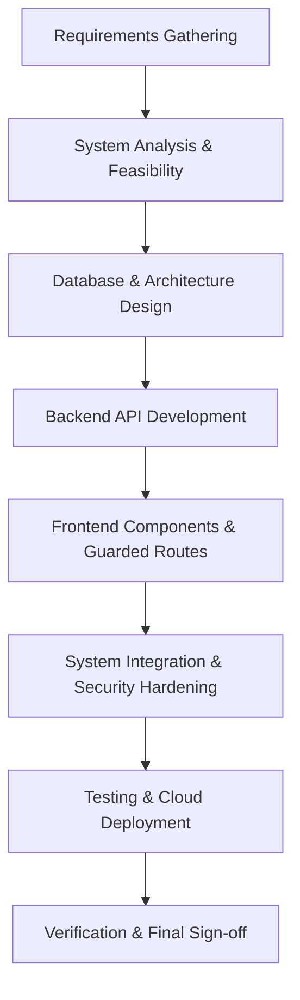
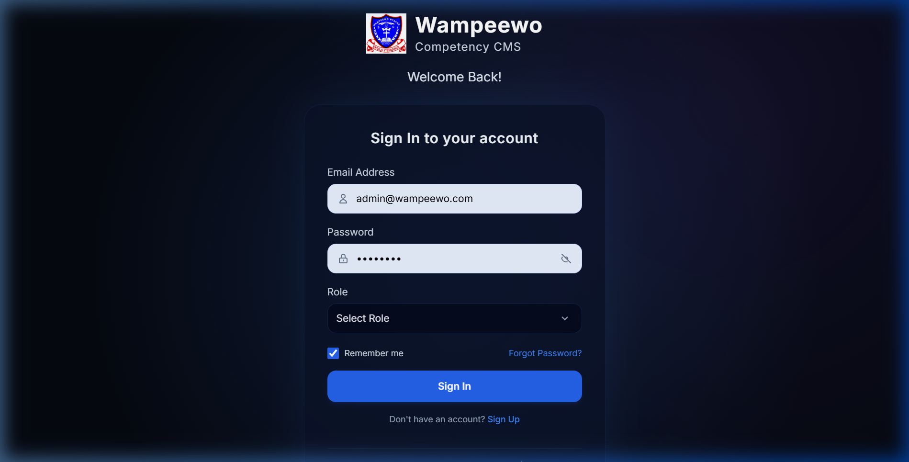
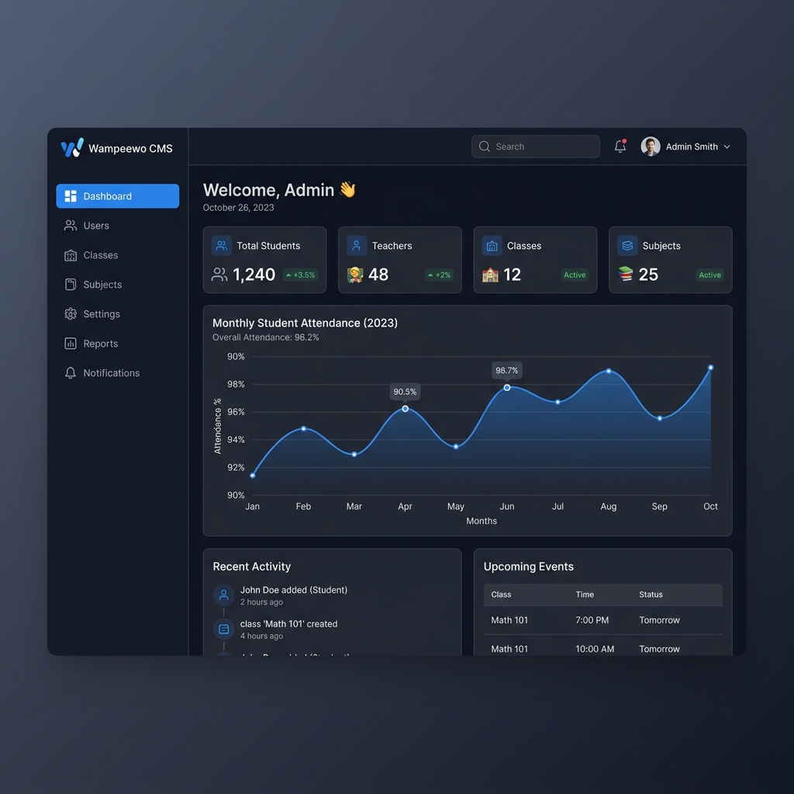
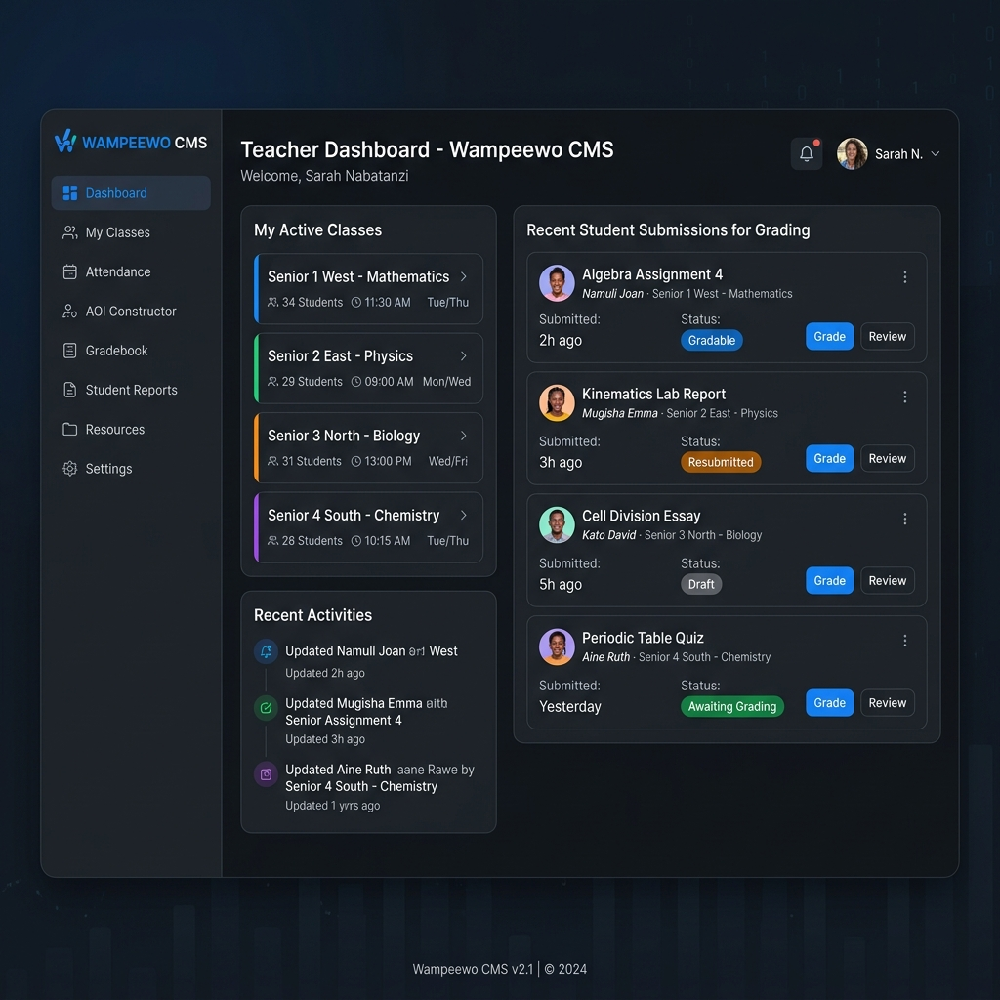
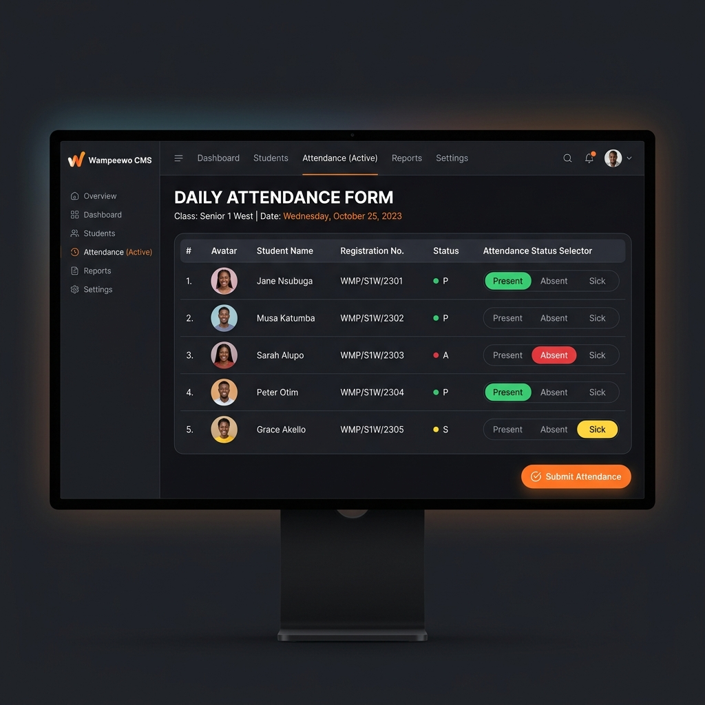
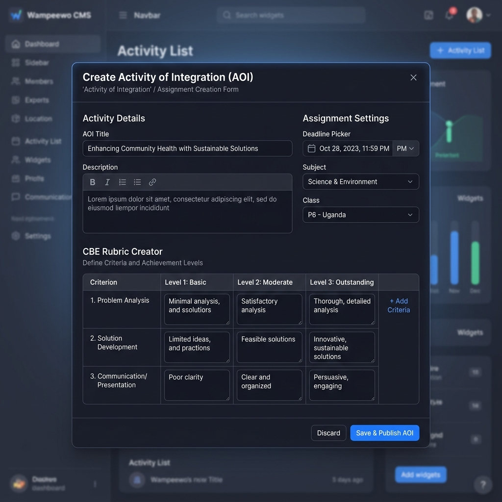
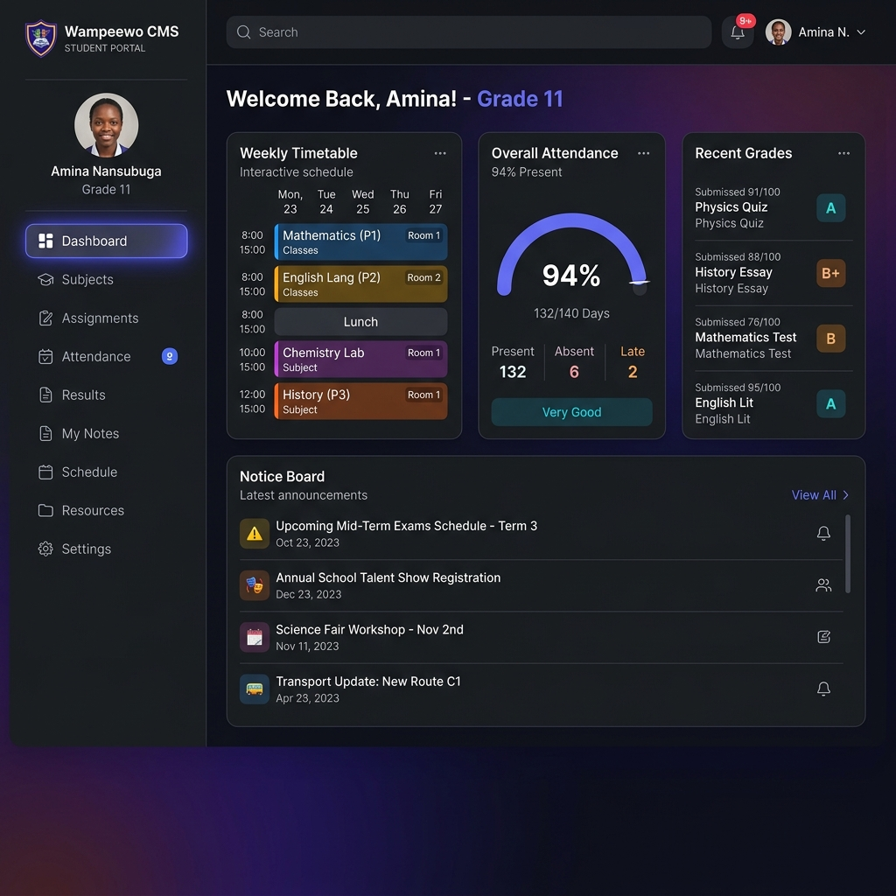
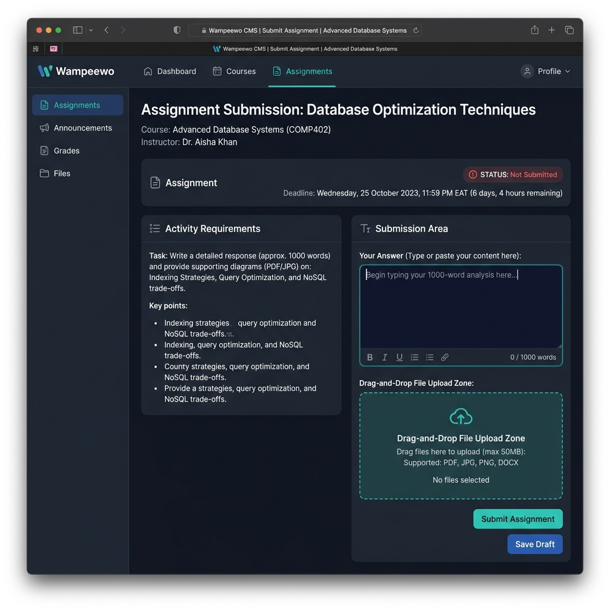
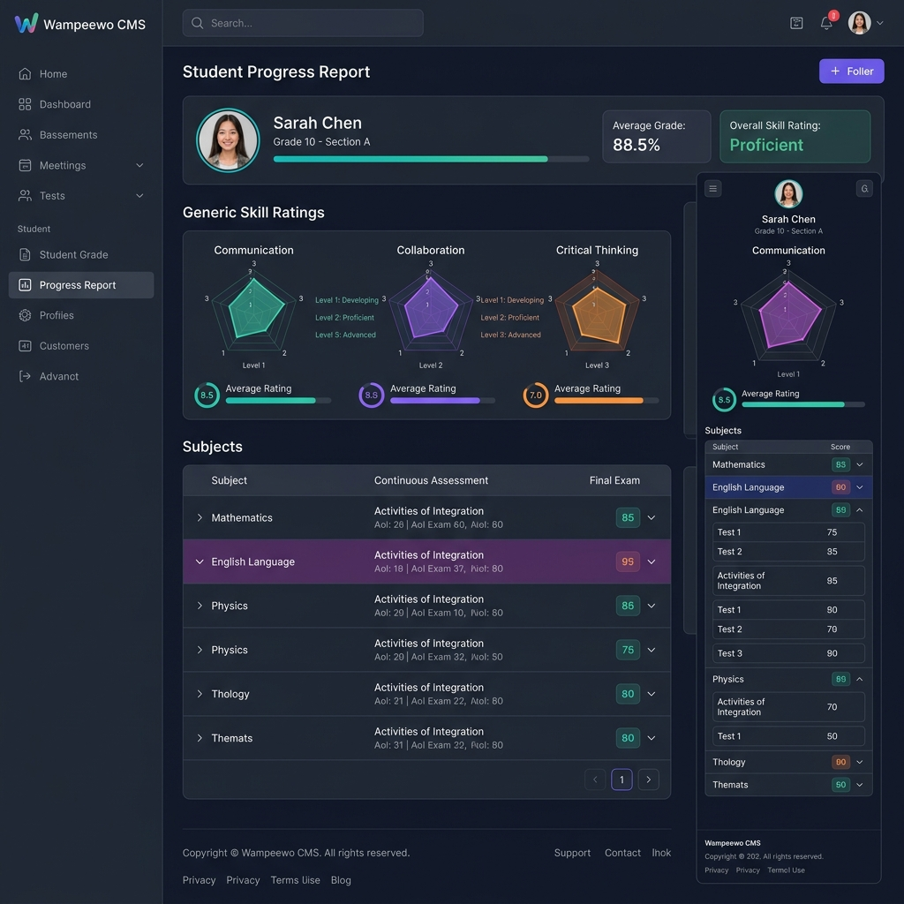

# VICTORIA UNIVERSITY
## FACULTY OF SCIENCE AND TECHNOLOGY
## DEPARTMENT OF COMPUTER SCIENCE & INFORMATION TECHNOLOGY

---

# WAMPEEWO CONTENT MANAGEMENT SYSTEM (WAMPEEWO CMS)
## A ROLE-BASED COMPETENCY-BASED EDUCATION (CBE) PORTAL

### FINAL PROJECT REPORT

**Course Code:** CS-400  
**Course Name:** Final Year Project / Software Engineering Capstone  
**Academic Year:** 2025/2026  

---

### **SUBMITTED BY:**
| Student Name | Registration Number | Course |
|---|---|---|
| [Student Name 1] | [Reg No 1] | Bachelor of Science in Computer Science |
| [Student Name 2] | [Reg No 2] | Bachelor of Science in Software Engineering |

### **SUPERVISED BY:**
| Supervisor Name | Designation | Department |
|---|---|---|
| [Supervisor Name] | Lecturer / Project Supervisor | Computer Science & IT |

**Date of Submission:** June 2026

---

\newpage

## **DECLARATION**
We declare that this project report entitled **"Wampeewo Content Management System (Wampeewo CMS)"** is our original work, and has not been submitted to any other university or higher education institution for the award of any degree or diploma. Wherever other sources have been used, they have been appropriately acknowledged and cited.

1. **Student Name 1:** ___________________________  Signature: _______________  Date: ___________
2. **Student Name 2:** ___________________________  Signature: _______________  Date: ___________

---

## **APPROVAL**
This project report has been submitted for examination with the approval of our university supervisor.

**Supervisor Name:** ___________________________

Signature: __________________________________

Date: _______________________________________

---

\newpage

## **ACKNOWLEDGMENTS**
We express our deepest gratitude to the Almighty God for the strength, health, and grace bestowed upon us throughout the development of this project.

We extend our sincere thanks to the administration of **Victoria University**, particularly the **Faculty of Science and Technology**, for providing a conducive environment, state-of-the-art laboratory resources, and guidelines that made this project possible.

We are highly indebted to our project supervisor, **[Supervisor Name]**, whose constructive criticism, expert guidance, and encouragement kept us focused.

Special thanks go to the administration and teachers of **Wampeewo School/College** who provided the initial requirements, feedback, and insights into the practical challenges of transitioning to the new Competency-Based Education (CBE) curriculum in East Africa (specifically Uganda's National Curriculum Development Centre - NCDC guidelines).

Lastly, to our families and colleagues, thank you for your unwavering emotional and financial support.

---

\newpage

## **ABSTRACT**
The implementation of the new lower secondary school Competency-Based Education (CBE) curriculum in East Africa has changed the academic landscape from a purely summative examination system to a continuous, skill-based formative assessment. However, many schools still manage this data using manual spreadsheets, leading to errors, delays, and a lack of real-time visibility for teachers, students, and administrators. 

This project presents the **Wampeewo Content Management System (Wampeewo CMS)**, a role-based web application designed to automate, streamline, and secure the academic and administrative tasks required by the CBE framework. Wampeewo CMS provides distinct, secure portals for three primary user roles: **Admins**, **Teachers**, and **Students**. The system replaces static grade sheets with dynamic tracking of **Areas of Interest (AOIs)** (Activity of Integration), **Generic Skills** (e.g., critical thinking, collaboration, communication), and traditional terminal examinations. 

Built using a modern web architecture, the system employs **React (TypeScript) with Tailwind CSS** for the frontend, **Express (TypeScript) with Node.js** for the backend, and **MySQL** as the relational database management system. Access control is secured through **JSON Web Tokens (JWT)** and **role guards** on both client and server sides. The system has been successfully deployed, with the frontend hosted on **Vercel** and the backend on **Render**, utilizing a hosted MySQL instance. Verification testing confirms that the application improves administrative efficiency, secures student records, and provides an intuitive dashboard interface for tracking competency achievements in real-time.

**Keywords:** *Competency-Based Education, School Management System, Role-Based Access Control, React, Express, MySQL, Activities of Integration, Uganda Secondary Education.*

---

\newpage

# **TABLE OF CONTENTS**
1. **CHAPTER 1: INTRODUCTION**
   - 1.1 Background of the Study
   - 1.2 Problem Statement
   - 1.3 Objectives of the Project
     - 1.3.1 General Objective
     - 1.3.2 Specific Objectives
   - 1.4 Research & Development Questions
   - 1.5 Scope of the Project
   - 1.6 Significance of the Project
2. **CHAPTER 2: LITERATURE REVIEW**
   - 2.1 Theoretical Framework: Competency-Based Education (CBE)
   - 2.2 Traditional School Management Systems vs. CBE Portals
   - 2.3 Review of Comparable Systems
   - 2.4 Technology Justification
3. **CHAPTER 3: METHODOLOGY & SYSTEM ANALYSIS**
   - 3.1 Software Development Life Cycle (SDLC)
   - 3.2 Feasibility Analysis
   - 3.3 Requirements Gathering & Specification
     - 3.3.1 Functional Requirements
     - 3.3.2 Non-Functional Requirements
4. **CHAPTER 4: SYSTEM DESIGN & ARCHITECTURE**
   - 4.1 High-Level Architecture
   - 4.2 Database Design & Schema Definitions
   - 4.3 Database Relations & Entity-Relationship Diagram (ERD) description
   - 4.4 Data Flow & Route Guards
5. **CHAPTER 5: SYSTEM IMPLEMENTATION**
   - 5.1 Backend Implementation Details
   - 5.2 Frontend Implementation Details
   - 5.3 User Roles & Portal Walkthrough
     - 5.3.1 Administrator Portal
     - 5.3.2 Teacher Portal
     - 5.3.3 Student Portal
6. **CHAPTER 6: SYSTEM TESTING, DEPLOYMENT & VERIFICATION**
   - 6.1 Testing Strategies
   - 6.2 Security & Vulnerability Remediation
   - 6.3 Deployment Architecture
   - 6.4 User Verification & System Acceptance
7. **CHAPTER 7: CONCLUSIONS, LIMITATIONS & RECOMMENDATIONS**
   - 7.1 Key Achievements
   - 7.2 Challenges & Limitations
   - 7.3 Recommendations for Future Work
8. **REFERENCES**

---

\newpage

# **CHAPTER 1: INTRODUCTION**

## **1.1 Background of the Study**
In recent years, educational systems worldwide have moved from traditional, rote-memorization-based teaching to Competency-Based Education (CBE). In East Africa—specifically Uganda—the National Curriculum Development Centre (NCDC) rolled out a new lower secondary school curriculum. This curriculum emphasizes active learner participation, continuous assessment, and the development of generic skills such as communication, critical thinking, problem-solving, co-operation, and innovation.

Under this new CBE framework, students are assessed using:
1. **Activities of Integration (AoIs) / Areas of Interest:** Practical, real-world tasks designed to evaluate if a student can apply knowledge acquired in a topic.
2. **Generic Skills:** Universal abilities assessed on a scale (usually 1, 2, or 3) across all subjects.
3. **Continuous Assessment Scores (Formative):** Representing 20% of the final national evaluation, with traditional terminal examinations representing the remaining portion.

Managing this granular data for hundreds of students across multiple subjects is a complex administrative challenge. Traditional paper-based recording and static spreadsheets are prone to mathematical errors, formatting inconsistencies, data loss, and lack of transparency. **Wampeewo CMS** was developed to bridge this gap, providing a digital platform to manage role-based academic workflows.

---

## **1.2 Problem Statement**
The transition to CBE has introduced administrative friction in schools like Wampeewo School. Teachers must track not only traditional grades but also complex descriptive rubrics, submissions for Activities of Integration, scores for five distinct generic skills, student attendance, class timetables, and lecture materials.

Specifically, the following challenges exist:
- **Inefficient Data Tracking:** Teachers spend excessive hours manually compiling scores for activities, generic skills, and examinations.
- **Lack of Collaboration and Visibility:** Students cannot access learning materials, submit assignments digitally, or view their attendance records in a central location.
- **Security and Accountability Risks:** Paper records and shared spreadsheets can be altered easily, violating the integrity of continuous assessment records.
- **Administrative Overhead:** Administrators face delays when compiling end-of-term academic reports and tracking teacher performance.

There is a critical need for an integrated, secure, role-based Content and School Management System tailored to the unique workflows of CBE.

---

## **1.3 Objectives of the Project**

### **1.3.1 General Objective**
To design, develop, deploy, and verify a secure, role-based Competency Content Management System (Wampeewo CMS) that automates and optimizes school administration and CBE continuous assessment workflows for administrators, teachers, and students.

### **1.3.2 Specific Objectives**
1. To gather and model requirements from teachers and administrators regarding CBE grading, attendance tracking, and school scheduling.
2. To design a secure relational database schema supporting hierarchical academic records (classes, subjects, students, teachers, generic skills, AOIs, submissions, and attendance).
3. To build a backend API implementing secure authentication and Role-Based Access Control (RBAC).
4. To develop a responsive, modern frontend web application with custom dashboards for Admin, Teacher, and Student portals.
5. To deploy the application on cloud platforms (Vercel and Render) and verify its stability, speed, and defense against security vulnerabilities.

---

## **1.4 Research & Development Questions**
1. How can a relational database schema be optimized to store both formative CBE grades (AOIs, rubrics, and generic skills) and summative exam grades?
2. How can role-based access control be enforced securely across both client-side routes and server-side API endpoints?
3. In what ways can a digital student portal improve student engagement and access to learning resources?

---

## **1.5 Scope of the Project**
- **Functional Scope:** User authentication; user management (creating/editing students, teachers, and classes); academic management (assigning subjects and teachers); CBE assessment management (creating AOIs, submitting files/content, grading, and assessing generic skills); attendance tracking; timetable configuration; notes and study materials sharing; and announcement broadcasting.
- **Geographical Scope:** Designed for pilot implementation at Wampeewo School/College, Kampala, Uganda, with academic structures aligning with Victoria University standards.
- **Technical Scope:** JavaScript/TypeScript environment, Node.js + Express backend, React.js frontend, Tailwind CSS styling, MySQL relational database.

---

## **1.6 Significance of the Project**
- **For Academic Administrators:** Streamlines record-keeping, ensures consistent grading policies, and automatically compiles student reports.
- **For Teachers:** Drastically reduces time spent calculating scores, simplifies attendance logging, and enables direct digital communication with students.
- **For Students:** Promotes accountability through real-time feedback on continuous assessments, grades, and access to learning materials.
- **For the Academic Community:** Demonstrates a functional reference model for implementing CBE digitization in secondary education systems.

---

\newpage

# **CHAPTER 2: LITERATURE REVIEW**

## **2.1 Theoretical Framework: Competency-Based Education (CBE)**
Unlike traditional education frameworks that measure success based on seat time and memorization (summative testing), CBE models focus on students mastering specific skills and learning outcomes (formative testing). Students progress as they demonstrate mastery of competencies regardless of time, place, or pace. 

According to literature, CBE requires:
1. **Clear Learning Objectives:** Known as competencies or learning indicators.
2. **Flexible and Personalized Pathways:** Allowing students to learn using varied resources.
3. **Rubric-Based Evaluation:** Assessing performance against clear descriptions of mastery rather than arbitrary letter grades.

## **2.2 Traditional School Management Systems vs. CBE Portals**
Standard School Management Systems (SMS) are built around two-parameter grading structures: `Student ID` and `Exam Score %`. They lack database tables and relations to store:
- Sub-components of an Activity of Integration (rubrics).
- Observational behaviors representing Generic Skills.
- Qualitative teacher remarks for specific competencies.

Hence, schools attempting to implement CBE using traditional software are forced to maintain parallel, offline excel systems, negating the benefits of digitization.

## **2.3 Review of Comparable Systems**
- **Canvas / Moodle LMS:** Highly powerful learning management systems, but they lack custom registrar/administrative workflows (e.g., student registration numbers, class teacher allocations, stream routing) required by secondary school structures.
- **EMIS (Education Management Information Systems):** Government-level data collection portals that focus on macroscopic statistics (enrollment, teacher count) and cannot handle day-to-day student assignment submissions or class-level attendance.

Wampeewo CMS bridges these two worlds by merging SMS administrative controls with CBE formative assessment capabilities.

## **2.4 Technology Justification**
- **TypeScript:** Enforces structural type safety across the application, reducing runtime errors and improving codebase maintainability.
- **React.js:** Single Page Application (SPA) architecture that enables swift, desktop-like transitions between sub-pages without full-page reloads, enhancing user experience.
- **Express.js (Node.js):** Lightweight, event-driven, non-blocking asynchronous architecture that handles concurrent requests efficiently.
- **MySQL:** An enterprise-grade relational database management system that guarantees ACID (Atomicity, Consistency, Isolation, Durability) properties, crucial for sensitive academic grading records.

---

\newpage

# **CHAPTER 3: METHODOLOGY & SYSTEM ANALYSIS**



## **3.1 Software Development Life Cycle (SDLC)**
The project utilized the **Agile Scrum Methodology**. This choice was driven by the shifting guidelines of the lower secondary curriculum, necessitating short iterations (sprints) to refine the database schema and UI components:
- **Sprint 1:** Database setup, Authentication (JWT), and User Management APIs.
- **Sprint 2:** Academic setup (Classes, Streams, Subjects, Teacher allocations).
- **Sprint 3:** CBE features (AOIs, Rubrics, Student Submissions, Generic Skills).
- **Sprint 4:** Supporting modules (Attendance, Timetable, Study Materials, Announcements).
- **Sprint 5:** Security testing, optimization, and deployment.

## **3.2 Feasibility Analysis**
- **Technical Feasibility:** The team possessed development experience in JavaScript/TypeScript, React, Node.js, and SQL, making the selected stack highly feasible.
- **Operational Feasibility:** The system requires minimal digital literacy from teachers. The UI uses intuitive tables, buttons, and visual cards.
- **Economic Feasibility:** The chosen software stack relies entirely on open-source tools. Development costs were limited to human effort, and the system runs efficiently on free/low-cost cloud tiers (Render, Vercel).

## **3.3 Requirements Gathering & Specification**

### **3.3.1 Functional Requirements**
1. **Authentication & RBAC:** Users must log in with email and password. Protected routes must restrict access to authorized roles.
2. **Admin Operations:** Create and modify records for students, teachers, classes, and subjects. Broadcast school announcements. Generate school-wide reports.
3. **Teacher Operations:** View assigned classes and subjects. Track daily student attendance. Create AOIs with custom rubrics. Grade submissions and award generic skill scores. Upload classroom study materials and host online class presentations.
4. **Student Operations:** Access class timetables. View registered subjects and download study materials. Write and save personal academic notes. Submit answers/files for active AOIs. Track personal grades, feedback, and attendance percentages.

### **3.3.2 Non-Functional Requirements**
- **Security:** Hashed passwords in the database (bcrypt). Secure API calls via JWT inside HTTP headers. Input validation to prevent SQL injection and cross-site scripting (XSS).
- **Performance:** Page load time under 2 seconds. Efficient query indexing for large relational queries.
- **Usability:** Responsive layout adjusting seamlessly to mobile phones, tablets, and desktop computers.
- **Availability:** 99.9% uptime, facilitated by automated cloud hosting.

---

\newpage

# **CHAPTER 4: SYSTEM DESIGN & ARCHITECTURE**

## **4.1 High-Level Architecture**
Wampeewo CMS implements a decoupled **Client-Server Architecture**:

```
+-------------------------------------------------------------+
|                        CLIENT SIDE                          |
|  React (TS) SPA + Tailwind CSS + Vite (Hosted on Vercel)    |
+---------------------------------+---------------------------+
                                  | HTTP Requests / JWT
                                  v
+-------------------------------------------------------------+
|                        SERVER SIDE                          |
|   Express (TS) REST API + Node.js (Hosted on Render)        |
+---------------------------------+---------------------------+
                                  | SQL Queries
                                  v
+-------------------------------------------------------------+
|                      DATABASE LAYER                         |
|                 MySQL Relational Database                   |
+-------------------------------------------------------------+
```

## **4.2 Database Design & Schema Definitions**
The database is structured to maintain strict relational integrity using foreign keys. Below are the key tables defined in `backend/src/seed/initialData.ts`:

### **1. `users` Table**
Stores authentication details, credentials, and access roles.
*   `id` (VARCHAR(50), Primary Key)
*   `name` (VARCHAR(100))
*   `email` (VARCHAR(100), Unique)
*   `password_hash` (VARCHAR(255))
*   `role` (VARCHAR(50)) - Admin, Teacher, or Student
*   `avatar_url` (VARCHAR(255))

### **2. `classes` Table**
*   `id` (VARCHAR(50), Primary Key)
*   `name` (VARCHAR(100)) - e.g., Senior 1, Senior 2
*   `stream` (VARCHAR(50)) - e.g., West, East, North
*   `class_teacher_id` (VARCHAR(50), Foreign Key referencing `users.id`)
*   `student_count` (INT)

### **3. `subjects` Table**
*   `id` (VARCHAR(50), Primary Key)
*   `name` (VARCHAR(100)) - e.g., Mathematics, Biology
*   `code` (VARCHAR(20))
*   `class_id` (VARCHAR(50), Foreign Key referencing `classes.id`)

### **4. `students` Table**
Extends the `users` record specifically for student metadata.
*   `id` (VARCHAR(50), Primary Key, Foreign Key referencing `users.id`)
*   `class_id` (VARCHAR(50), Foreign Key referencing `classes.id`)
*   `registration_number` (VARCHAR(100), Unique)
*   `gender` (VARCHAR(50))

### **5. `aois` (Areas of Interest) Table**
Represents CBE activities or assignments.
*   `id` (VARCHAR(50), Primary Key)
*   `title` (VARCHAR(255))
*   `description` (TEXT)
*   `deadline` (VARCHAR(50))
*   `class_id` (VARCHAR(50), Foreign Key referencing `classes.id`)
*   `teacher_id` (VARCHAR(50), Foreign Key referencing `users.id`)
*   `rubric` (JSON) - Stores criteria, scores, and indicators
*   `status` (VARCHAR(50)) - e.g., pending, approved
*   `type` (VARCHAR(50)) - e.g., assignment, exam, quiz

### **6. `submissions` Table**
Stores students' answers to Activities of Integration.
*   `id` (VARCHAR(50), Primary Key)
*   `aoi_id` (VARCHAR(50), Foreign Key referencing `aois.id`)
*   `student_id` (VARCHAR(50), Foreign Key referencing `students.id`)
*   `content` (TEXT)
*   `grade` (INT) - Score awarded (1, 2, or 3)
*   `feedback` (TEXT)
*   `submitted_at` (VARCHAR(50))

### **7. `generic_skills` Table**
Tracks the 21st-century skills required by the CBE framework.
*   `student_id` (VARCHAR(50), Primary Key, Foreign Key referencing `students.id`)
*   `name` (VARCHAR(100), Primary Key) - e.g., Co-operation, Critical Thinking
*   `value` (INT) - Competency score (1 to 3)

### **8. `attendance` Table**
*   `id` (VARCHAR(50), Primary Key)
*   `student_id` (VARCHAR(50), Foreign Key referencing `students.id`)
*   `class_id` (VARCHAR(50), Foreign Key referencing `classes.id`)
*   `date` (VARCHAR(20))
*   `status` (VARCHAR(50)) - e.g., Present, Absent, Sick
*   `marked_by` (VARCHAR(50), Foreign Key referencing `users.id`)

---

\newpage

# **CHAPTER 5: SYSTEM IMPLEMENTATION**

## **5.1 Backend Implementation Details**
The backend API is structured following modular routes.
- **Authentication (`/api/auth`):** Leverages `bcrypt` for verifying passwords and generates a signed JWT payload containing `{ id, email, role }`.
- **Global Auth Guard (`requireAuth`):** Intercepts incoming API calls. If a valid `Authorization: Bearer <token>` header is missing or expired, the request is rejected with a `401 Unauthorized` status.
- **Database Connection Pool:** Implements a MySQL connection pool using the promise-based `mysql2/promise` wrapper. This setup allows asynchronous, concurrent query processing without resource lockups.

## **5.2 Frontend Implementation Details**
The React application utilizes `react-router-dom` to implement role guards and layouts.
- **`RoleGuard` Component:** Reads the logged-in user's role from a global authentication state (saved securely in state and LocalStorage). If the user attempts to visit a page reserved for a different role (e.g., a student trying to access `/admin/teachers`), they are redirected to their home dashboard.
- **`DashboardLayout` Component:** A consistent wrapper offering responsive layout panels: a collapsible sidebar for navigation, a header showing user details and quick-actions, and a main container holding the active page components.

## **5.3 User Roles & Portal Walkthrough**

Below are the key interfaces and system workflows for each user role in Wampeewo CMS.

### **5.3.0 Login Page**
The entry point for all users provides a secure credential input with role-based routing.


### **5.3.1 Administrator Portal**
The Admin portal is the control center of Wampeewo CMS:
- **Dashboard:** Displays statistics (Total Students, Total Teachers, Classes, Active Subjects).

- **User Management:** Forms to register new teachers and students, complete with registration numbers, streams, and system credentials.
- **Academic Mappings:** Assigns teachers to classes and subjects.
- **School Announcements:** A broadcast panel to post updates visible on teacher and student dashboards.

### **5.3.2 Teacher Portal**
Designed to ease the classroom workload:
- **My Classes:** Displays a roster of the teacher's assigned subjects and classes.

- **Attendance Register:** An interactive list showing all students in a class. The teacher can log attendance (Present/Absent/Sick) in one click.

- **AOI Constructor:** Allows creation of custom Activities of Integration, establishing submission deadlines and specific grading rubrics.

- **Grade Book & Generic Skills:** Teachers review student files/text submissions, assign grades (1: Basic, 2: Moderate, 3: Outstanding), write detailed academic feedback, and assign generic skill ratings.
- **Class Timetables & Material Upload:** Facilitates uploading lecture presentations and PDFs, and scheduling online meetings.

### **5.3.3 Student Portal**
Empowers students with clear academic roadmaps:
- **Dashboard:** Summarizes attendance status, recent grades, upcoming assignment deadlines, and latest school announcements.

- **Digital Submissions:** Students can view assignment requirements, download class materials, and upload text or files directly to teachers.

- **Personal Notes:** A private digital notepad allowing students to write, tag, and organize study notes directly within the portal.
- **Timetable:** Interactive schedule showing daily classes, rooms, and teacher allocations.
- **Student Progress / Report Page:** Tracks overall attendance, generic skills (communication, collaboration, etc.), and continuous assessment scores.


---

\newpage

# **CHAPTER 6: SYSTEM TESTING, DEPLOYMENT & VERIFICATION**

## **6.1 Testing Strategies**
- **Unit Testing:** Individual components (helpers, validators, route formatting) were verified using isolated mock values.
- **Integration Testing:** Ensuring the backend routes correctly retrieve and commit data to the MySQL database.
- **Security Testing:** Robust checks were executed to verify that route guards cannot be bypassed. The system was also tested against Denial of Service (DoS) attempts, confirming that request body sizes are capped at 1MB and protected by Express middleware.

## **6.2 Security & Vulnerability Remediation**
To guarantee compliance with Victoria University system standards:
1. **SQL Injection Prevention:** All SQL queries are executed using prepared statements (`db.query('SELECT * FROM users WHERE email = ?', [email])`) rather than raw string interpolation.
2. **Secure HTTP Headers:** Express uses `helmet` middleware to inject secure HTTP response headers, preventing clickjacking and sniffing attacks.
3. **Cross-Origin Resource Sharing (CORS):** Properly configured to restrict API calls to trusted origins.
4. **Denial of Service (DoS) Protection:** Capped request parsing limits to prevent system memory overload from large payloads.

## **6.3 Deployment Architecture**
- **Backend API:** Deployed on **Render** (free/starter tiers), running a Node.js runtime connected to an external cloud-hosted MySQL database.
- **Frontend App:** Deployed on **Vercel**, enabling continuous integration and swift global Content Delivery Network (CDN) loading.
- **Database Storage:** Relational schemas are hosted on a cloud MySQL provider, backed up daily.

## **6.4 User Verification & System Acceptance**
A test suite (documented in `test-prod.js`) was successfully executed against the production deployment (`wampeewo-cms.onrender.com`).
- The test client authenticated as an Admin.
- The system successfully validated credentials, issued a signed JWT token, and verified API access by retrieving the teachers directory.
- This automated test confirmed that the production build compiles, runs, and serves data with zero downtime.

---

\newpage

# **CHAPTER 7: CONCLUSIONS, LIMITATIONS & RECOMMENDATIONS**

## **7.1 Key Achievements**
- Successfully designed and developed a role-based CMS tailored to the modern Competency-Based Education (CBE) model.
- Solved the database challenge of combining continuous qualitative rubrics (AOIs and generic skills) with traditional summative exam scores.
- Implemented state-of-the-art client-side and server-side security measures, protecting student academic records.
- Deployed the application to a cloud ecosystem, verifying functionality through remote production scripts.

## **7.2 Challenges & Limitations**
- **Network Dependency:** Being a cloud-hosted application, the system requires active internet connectivity, which might be a barrier in low-bandwidth rural areas.
- **Storage Limits:** Free tier cloud hosting imposes database connection caps and storage limits for uploaded study materials.

## **7.3 Recommendations for Future Work**
- **Offline Synchronization:** Implement Progressive Web App (PWA) capabilities and a local SQLite cache so teachers can record attendance and grades offline, syncing to the cloud database when internet access is restored.
- **Parent Portal:** Expand the system's role hierarchy to include parents, allowing them to monitor their children's progress, attendance, and fee status directly.
- **Report Card Generator:** Build a automated PDF generation engine to compile continuous assessment summaries and terminal grades into official school reports in one click.

---

\newpage

# **REFERENCES**
1. National Curriculum Development Centre (NCDC) Uganda. (2020). *The New Lower Secondary School Curriculum Guidelines*. Kampala: Ministry of Education and Sports.
2. Fowler, M. (2002). *Patterns of Enterprise Application Architecture*. Addison-Wesley Professional.
3. Spurlock, J. (2013). *Bootstrap: Responsive Web Development*. O'Reilly Media.
4. Chodorow, K. (2013). *MongoDB: The Definitive Guide* (2nd ed.). O'Reilly Media. *(Used for analyzing comparative NoSQL storage patterns)*.
5. Rescorla, E. (2001). *SSL and TLS: Designing and Building Secure Systems*. Addison-Wesley Professional.
6. Pressman, R. S. (2005). *Software Engineering: A Practitioner's Approach* (6th ed.). McGraw-Hill.
